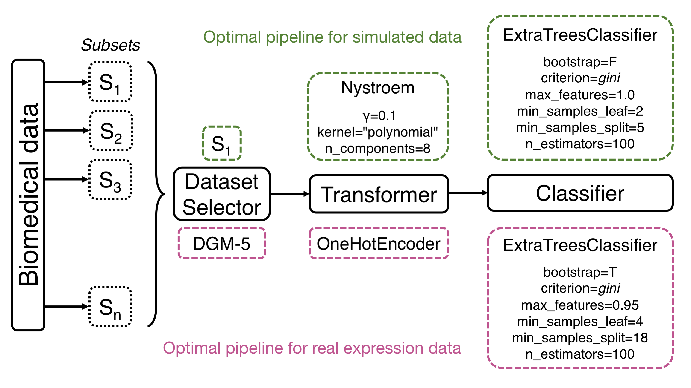

## Results
Our main goal is to test the performance of methods to identify features that discriminate between groups and optimize the classification accuracy.

### Simulated data
We compare the accuracy of each method for *r* = 100 replicate simulated datasets with moderate interaction effect.
These values of the effect size in the simulations generate adequately challenging datasets so that the methods' accuracies stay moderate and do not cluster around 0.5 or 1.
Each replicate data set is split into training and holdout.
The TPOT-DS, standard TPOT and XGBoost models are built from the training dataset, then the trained model is applied to the independent holdout data to obtain the generalization accuracy. 
The general workflow of TPOT-DS is shown in Figure {@fig:flow} along with the best pipeline found with the specified template `Dataset Selector-Transformer-Classifier` in simulated data (top) and real-world expression data (bottom).

{#fig:flow width="90%"}

For simulated dataset, the best pipeline selects subset $S_1$ then constructs an approximate feature map for a linear kernel with Nystroem, which uses a subset of the data as basis for the approximation.
The final prediction is made with an extra-trees classifier that fits a number of randomized decision trees on various sub-samples of the dataset with the presented optimized parameters (Fig. {@fig:flow}).
This pipeline yields the highest holdout prediction accuracy of 0.84.

Our simulation design produces a reasonable distribution of the functional features in all subsets, of which proportions are shown in Table [S1].
According to Eq. {@eq:p_subset}, the earlier the subset, the more functional features it has.
Therefore, our first aim is to determine how well TPOT-DS can identify the first subset ($S_1$) that contains the largest number of informative features.
In 100 replications, TPOT-DS correctly selects subset $S_1$ in 75 resulting pipelines (Fig. {@fig:simDS}), with an average cross-validated accuracy on the training set of 0.73 and holdout accuracy of 0.69.
Without DS, the standard TPOT and tuned XGBoost models respectively report a cross-validated accuracy of [0.661] and 0.533, and holdout accuracy of [0.565] and 0.575.

{#fig:simDS width="100%"}

For a dataset of the size simulated in our study (*m*=200 samples and *p* = 5000 attributes), TPOT-DS has a 65-minute runtime on a low performance computing machine with an Intel Xeon E5-2690 2.60GHz CPU, 28 cores and 256GB of RAM, whereas standard TPOT has a 18.5-hour runtime, approximately 17 times slower.

### RNA-Seq expression data
We apply standard TPOT, TPOT-DS and XGBoost to the RNA-Seq study of 78 major depressive disorder (MDD) subjects and 79 healthy controls (HC) described in [@doi:10.1038/s41398-018-0234-3].
The dataset contains 5,912 genes after preprocessing and filtering (see Methods for more detail).
We excluded 277 genes that did not belong to 23 subsets of interconnected genes (DGMs) so that the dataset remains the same across the three methods.
As with simulated data, all models are built from the training dataset (61 HC, 56 MDD), then the trained model is applied to the independent holdout data (18 HC, 22 MDD) to obtain the generalization accuracy.

The best pipeline selects subset DGM-5 then scales each expression feature by its maximum absolute value.
Similar to the best pipeline for simulated data, the final prediction is made with an extra-trees classifier with a different set of optimized parameters (Fig. {@fig:flow}).
This pipeline yields the highest holdout prediction accuracy of 0.75.

{#fig:realDS width="80%"}

In 100 replications, TPOT-DS selects DGM-5 (291 genes) 64 times to be the subset most predictive of the diagnosis status (Fig. {@fig:realDS}), with an average cross-validated accuracy on the training set of 0.715 and out-of-sample accuracy of 0.636.
In the previous study with a modular network approach, we showed that DGM-5 has statistically significant associations with depression severity measured by the Montgomery-Åsberg Depression Scale (MADRS).
Although there is no direct link between the top ten genes of the module (Fig. {@fig:featImp}A) and MDD in the literature, many of these genes interact with other MDD-related genes.
For example, NR2C2 and TCF7L1 interact with FKBP5 gene whose association with MDD has been strongly suggested [@doi:10.1016/j.jad.2010.02.113;@doi:10.1016/j.brainres.2009.06.036;@doi:10.1038/ng1479]. []
Further, with 82% overlap of DGM-5's genes in a separate dataset from the RNA-Seq study by Mostafavi et al. [@doi:10.1038/mp.2013.161], this gene collection's enrichment score was also shown to be significantly associated with the diagnosis status in this independent dataset.

{#fig:featImp width="100%"}

After DGM-5, DGM-13 (134 genes) was selected by TPOT-DS 30 times (Fig. {@fig:realDS}), with an average cross-validated accuracy on the training set of 0.717 and out-of-sample accuracy of 0.563.
Previous network approach did not find statistically significant association between this module's enrichment score and the MADRS.
Gene set enrichment analysis reported DGM-13's involvement in axon guidance and developmental biology pathways with Reactome-FDR *q*-value $<$ 0.05.

Without DS, the standard TPOT and tuned XGBoost models respectively report a cross-validated accuracy of [] and 0.543, and holdout accuracy of [] and 0.525.

On the same low performance computing machine (Intel Xeon E5-2690 2.60GHz CPU, 28 cores and 256GB RAM), each replication of TPOT-DS on the expression data takes on average [] minutes, whereas standard TPOT takes [] hours, approximately [] times slower.
